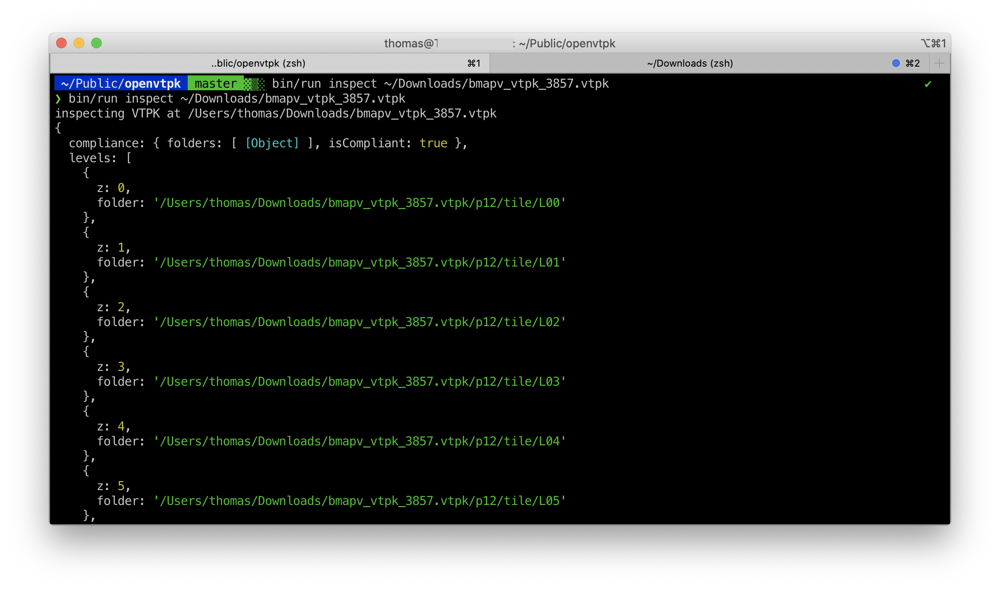
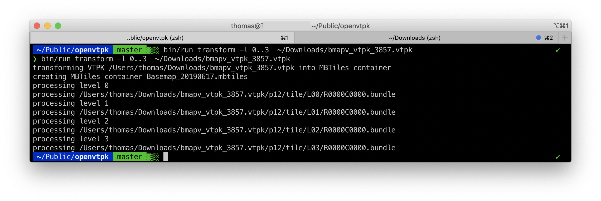

# OpenVTPK

ESRI's Vector Tile Package (VTPK) archive contains vector tiles that follow Mapbox' Vector Tile specification v2.0. In addition all resources to render the tiles are included (i.e. stylesheet, fonts, etc.).

Unfortunately none of the open source vector tile servers is able to process VTPK packages. Most require either an MBTiles container or a GeoPackage.

The aim of OpenVTPK is to extract the tiles from a VTPK and to re-package them into a container that is supported by open source tile servers.

In the first run repackaging from VTPK to MBTiles is supported.

## Motivation

Austria's government publishes detailed geospatial data like vector and raster tiles, elevation data etc. at [data.gv.at](https://www.data.gv.at/?s=basemap.at). One can find vector tiles for the [region of Austria](https://www.data.gv.at/katalog/dataset/a73befc7-575f-48cb-8eb9-b05172a8c9e3) in order to use them offline. The publishing format ist VTPK.

## What to do before running OpenVTPK

VTPK packages are zipped archives. You can unzip them by using your favorite software like 7z. For inexperienced users it may be easyer to add the _.zip_ extension to the _.vptk_ file (so you end up with _*.vtpk.zip_).

OpenVTPK expects the VTPK package to be unzipped into a folder of your choice. Later on this folder will be referred to as _SOURCEFOLDER_.

## Installation

Please note that you need to install at least NodeJS 10 or newer!

```shell
  git clone https://github.com/syncpoint/openvtpk.git
```
In order to install all NodeJS modules required change into the folder ```openvtpk``` and run

```shell
  npm install
```

OpenVTPK ist using Heroku's [Open CLI FRamework (OCLIF)](https://github.com/oclif/oclif) in order to provide a professional user experience. After installing OpenVTPK you may run ```bin/run``` to get information about the commands available.

The screenshot below shows all steps required to install and verify OpenVTPK.


## Inspecting an VTPK archive

OpenVTPK is able to inspect an VTPK archive. So one can decide which zoom level to transform.

```shell
  bin/run inspect SOURCEFOLDER
```

See the screenshot below as an example for Austria's basemap.at offline vector tiles.


## Running a transformation

If your expanded VTPK container is located in _SOURCEFOLDER_ run the following in order to repackage the tiles to an MBTiles container. You may limit the zoom levels by providing the optional ```-l=minZoomLevel...maxZoomLevel``` parameter.

```shell
  bin/run transform SOURCEFOLDER [-l=min..max]
```

I.e. to process the levels 7 to 11 use ```-l=7..11```.
If you use ```-l=..6``` the levels 0 to 6 wil be processed.

By setting the flag to ```-l=14..``` all levels from (including) 14 up to
the maximum level available will be processed.

The default value for this flag is ```-l=0..```.

The screenshot below shows the transformation for the zoom levels 0 to 3. The resulting MBTiles files can be found in the root folder of OpenVTPK.



### What you get

OpenVTPK will 

* create an MBTiles container named after the data in the ```root.json``` file
* extract the vector tiles from the VTPK folder
* extract the layer names
* write the tiles to the MBTiles container
* write metadata (including the layer names extracted previously) to the MBTiles container

Depending on the size of your VTPK and the levels to extract running OpenVTPK will take a few minutes.

If you run OpenVTPK multiple times please make sure to remove the existing MBtiles file.

## How to view the tiles

Please use your favorite tile server to view the basemap.at tiles offline. 

### @mapbox/mbview
An easy-to-use option may be [@mapbox/mbview](https://github.com/mapbox/mbview). Just clone the repository and start the tile server

```javascript
node ./cli.js PATH_TO_YOUR/basemap.at.mbtiles
```

Open your browser and be a little patient:


### klokantech/tileserver-gl (Docker)
If you prefer using a docker container _tileserver-gl_ can be a good start. Run the following command to start the container within the folder where you stored the mbtiles file:

```bash
docker run --rm -it -v $(pwd):/data -p 8080:80 klokantech/tileserver-gl
```

Open your browser and visit ```http://localhost:8080```:


## How to style the maps

The provided VTPK container also includes all resources required to style the vector tiles:
* fonts
* sprites
* styles 

For a detailed how-to please read our example for [basemap.at](https://github.com/syncpoint/basemap.at)

